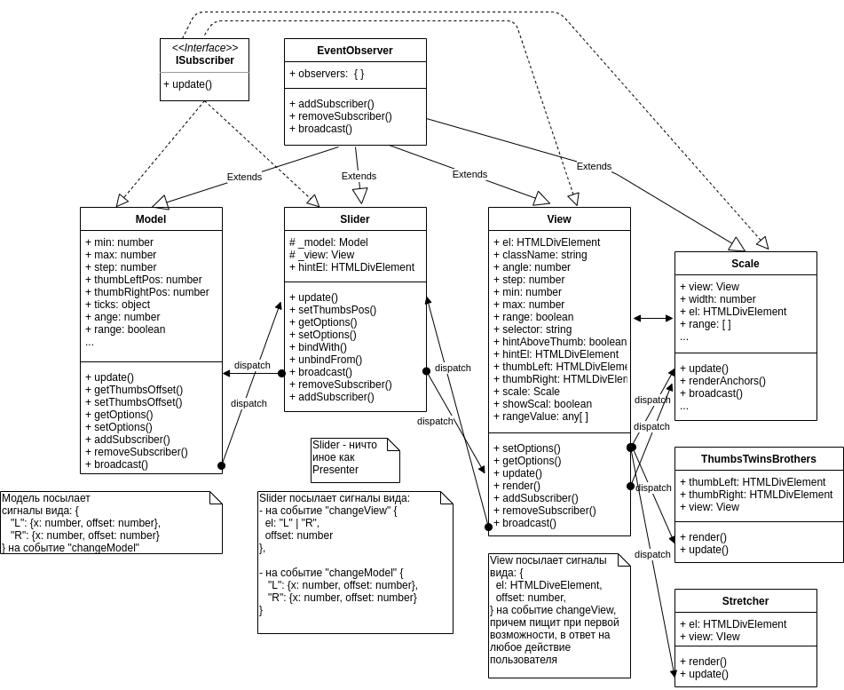

# Slider
## [Демо-страница слайдера: ](https://grigorenkosergey.github.io/sliderDemo/index.html)
Разработка велась на платформе Node.js v13.14.0.  
Используемая версия jquery - 3.5.1.

## Подключение 
Клонируй одним из возможных способов:  
`git clone https://github.com/GrigorenkoSergey/Slider.git`  
`git clone git@github.com:GrigorenkoSergey/Slider.git`  
Или просто скачай [ZIP архив](https://github.com/GrigorenkoSergey/Slider/archive/master.zip).

## Развертывание.  
Зайди в установленную директорию (*Slider*) и выполни команду
`npm install`  
Если выдаст ошибку, попробуй переустановить ***babel-loader*** командами  
`npm uninstall babel-loader @babel/core @babel/preset-env`  
`npm install -D babel-loader @babel/core @babel/preset-env`

Запуск webpack-dev-server  
`npm run dev`  
Запуск production build  
`npm run build`  
Запуск тестов  
`npm run test`

## Структура проекта
```
.
├── src
│   ├── assets
|   │   ├── blocks
|   |   |   |
|   |   |   ├── helpers
|   |   |   │   ├── functions
|   |   |   │   │   └── is-increasing-sequence.ts
|   |   |   │   ├── EventObserver.ts
|   |   |   │   ├── interfaces.ts
|   |   |   │   └── slider-events.ts
|   |   |   |
|   |   |   ├── demo-page
|   |   |   │   ├── components
|   |   |   |   │   ├── BoundedInput
|   |   |   |   │   ├── Example
|   |   |   |   │   ├── examples
|   |   |   |   │   ├── js-slider
|   |   |   |   │   ├── SliderOptionsPalette
|   |   |   |   │   ├── template
|   |   |   │   │   └── usage-examples
|   |   |   │   │ 
|   |   |   │   ├── demo-page.pug
|   |   |   │   ├── demo-page.scss
|   |   |   │   └── demo-page.ts
|   |   |   |
|   |   │   └── Slider
|   |   |       ├── components
|   |   |       │   ├── Model
|   |   │       |   |   ├── components
|   |   |       │   |   |   ├── model-options-default.ts
|   |   |       │   |   |   ├── model-type-guards.ts
|   |   |       │   |   |   ├── model-types.ts
|   |   |       │   |   |   └── ModelValidator.ts
|   |   │       |   |   └── Model.ts
|   |   │       |   |   
|   |   |       │   ├── Presenter
|   |   │       |   |   ├── components
|   |   |       │   |   |   └── PresenterNormalizer.ts
|   |   |       │   │   └── Presenter.ts
|   |   |       │   │   
|   |   |       │   └── View
|   |   |       │       ├── components
|   |   |       │       │   ├── Hint.ts
|   |   |       │       │   ├── Scale.ts
|   |   |       │       │   ├── Stretcher.ts
|   |   |       │       │   ├── Thumbs.ts
|   |   |       │       │   ├── view-options-default.ts
|   |   |       │       │   ├── view-type-guards.ts
|   |   |       │       │   └── view-types.ts
|   |   |       │       └── View.ts
|   |   |       │      
|   |   |       ├── jquery.slider.d.ts
|   |   |       ├── slider.scss
|   |   |       └── Slider.ts
|   |   |    
|   │   ├── fonts
|   │   └── images
|   |   
│   ├── index.pug
│   └── index.ts 
|
└─ test
   ├── helpers.spec.ts
   ├── Model.spec.ts
   ├── Presenter.spec.ts
   └── View.spec.ts
```

## Использование
Сам слайдер должен находиться в каком-либо блоке (*div*). Возможны 2 варианта вызова: 
```js 
    const slider = new Slider(options); //только с webpack
    const slider = $(selector).slider(options); //c jquery, значение selector будет проигнорировано
```
В объекте настроек, передаваемых параметром **options** есть поле **selector**, в которое необходимо записать селектор выбора, аналогичный тому, что мы передаем через ```document.body.querySelector(selector)``` или через ```$(selector)```.

## Опции
| Опция | Описание |
|-------|----------|
| `selector: string` | Единственная обязательная опция. CSS-селектор выбора блока, содержащего наш слайдер |
| `min: number` | По умолчанию 0. Минимальное значение шкалы диапазона. |
| `max: number` | По умолчанию 100. Максимальное значение шкалы диапазона. |
| `step: number` | По умолчанию 1/100. Значения бегунка всегда кратны шагу. |
| `partsAmount: number` | По умолчанию 2. На сколько частей (не всегда одинаковых) делим интерактивную шкалу. |
| `thumbLeftValue: number` | По умолчанию равен `min`. Можем установить положение левого бегунка. |
| `thumbRightValue: number | null` | По умолчанию `null`. Можем установить положение правого бегунка. |
| `range: boolean` | По умолчанию `false`. Отображение одного или двух бегунков. При установке в `true` значение положения правого бегунка становится равным максимально допустимому значению, кратному шагу. |
| `precision: number` | По умолчанию 0. Меняется в пределах [0, 3]. Может принимать только целые значения. Означает количество знаков округления. |
| `alternativeRange: string[]` | По умолчанию []. Влияет на отображение шкалы и подсказок над бегунками. Допускается указывать любой строковый массив, длиной не менее 2. К примеру, `["Jan", "Feb", "March", "Apr", "May", "Jun", "Jul", "Aug", "Sep", "Oct", "Nov", "Dec"]`. Значение `min` автоматически становится равным нулю, значение `max` - величине последнего индекса массива. Остальные значения, хранящиеся в опциях слайдера, также остаются числами. Сбрасывается при установке `min` или `max`. |
| `className: string` | По умолчанию `slider`. Это имя блока, именованного по методологии BEM, который будет сгенерирован в контейнере со своими элементами. К нему привязаны стили слайдера. При необходимости изменить стили поправь исходный (S)?CSS файл. Если возможен конфликт имен, просто переименуй приставку `slider` в стилях, на любое имя, заданное в этом свойстве, например на `superMegaCoolSlider`. Однако, в этом случае, возможно появление ошибок в тестах. |
| `hintAboveThumb: boolean ` | По умолчанию `true`. Отображение подсказки над кругляшом при клике на нем и его передвижении. |
| `hintAlwaysShow: boolean ` | По умолчанию `false`. Если установлено в `true`, подсказка показывается всегда. При этом значение `hintAboveThumb` игнорируется. |
| `angle: number` | По умолчанию 0. Поворот слайдера. Принимает значения от 0 до 90. При этом размер самого слайдера всегда будет зависить только от ширины его контейнера. |
| `showScale: boolean` | По умолчанию `true`. Под слайдером отображаются значения шкалы, кратные шагу. Их количество зависит от свойства `partsAmount`. При щелчке по ним ближайший кругляш бежит к этому значению, кроме крайнего правого - здесь кругляш остановится на максимальном кратном шагу значении. При желании можно поменять отображение значений с помощью свойства `alternativeRange`. |

## API
### getOptions()
Используется для того, чтобы узнать значения опций слайдера. Возвращает объект со значениями опций.

### setOptions(options)
Настройка доступных опций на лету. Возвращает объект слайдера.
Пример:
```js
slider.setOptions({ range: true, max: -100 });
```

### getOffsets()
Возвращает объект `{ left: number, right: number }`, где указаны относительные расположения левого и правого бегунков относительно шкалы (0 - начало шкалы, 1 - конец шкалы). При отсутствии правого бегунка значение `right == Infinity`. Полезно при привязке других элементов, когда мы хотим масштабировать другой диапазон к значению нашего диапазона (см. примеры использования).

### onChange( { callback?: function } )
Сам по себе бегунок бесполезен. Он должен быть связан с какими-либо данными и его перемещение должно вызывать какие-то дополнительные  полезные действия. К примеру, пользователь, двигая кругляш, меняет возможные значения срока ипотеки. Какая-то сторонняя функция высчитывает итоговую сумму (которая зависит от положения бегунка), которую он заплатит и отображает в каком-то поле. Таких элементов, привязанных к одному слайдеру, может быть сколько угодно.

`callback` - функция вида `(data?: { event, cause }) => unknown`. Здесь `event` - событие `changeSlider`, которое возникает при любом изменении слайдера, и `cause` - событие, которое вызвало это изменение. Иногда полезно (хотя и очень редко), если мы хотим отфильтровать некоторые события. |

### Пример использования привязки (демо-страница, последний пример).
Пусть в DOM у нас имеется элемент ```<div class="js-slider_test_F></div> ```  
Картинка `usage-examples__img`- это спрайт, состоящий из 14 картинок по 5 в ряду, 3 ряда.  
Высота спрайта 506 пикселей, ширина 918.  
Упрощенно можно рассмотреть спрайт как двумерную матрицу 3x5, где каждая ячейка - картинка.  
Тогда в js-файле указываем:
```js
const optionsF = {
  max: 1000,
  min: 0,
  step: 10,
  selector: '.js-slider_test_F',
  angle: 0,
  range: false,
  hintAboveThumb: true,
  showScale: false,
}
// Значения min, max, step особо не важны, они устанавливаются для обеспечения плавности
// движения бегунка.

const sliderF = $('.js-slider_test_F').slider(optionsF);

selector = '.usage-examles__img';
const birdImg = document.querySelector(selector);

sliderF.onChange({
  callback: () => {
    const imgWidth = 918 / 5;
    const imgHeight = 506 / 3;

    // т.к. нам неинтересны абсолютные значения положения бегунка,
    // то мы будем использовать относительные
    const offset = sliderF.getOffsets().left;
    
    // offset == 0 -> 0
    // offset == 1 -> 13
    const resLeft = Math.round(offset * 13);

    const offsetLeft = imgWidth * (resLeft % 5);
    const offsetTop = imgHeight * Math.floor(resLeft / 5);

    birdImg.style.backgroundPositionX = -offsetLeft + 'px';
    birdImg.style.backgroundPositionY = -offsetTop + 'px';
  },
})
```
Итого у нас один бегунок, положение которого мы связали с номером картинки.
Крайнее левое положение отображает первую картинку (нумерация с нуля), в крайнем правом положении мы отображаем последнюю 14-ю картинку (с индексом 13).
Полный код примеров использования смотри в ***src/assets/demo-page/components/usage-examples/usage-examples.ts***


## uml-диаграмма


